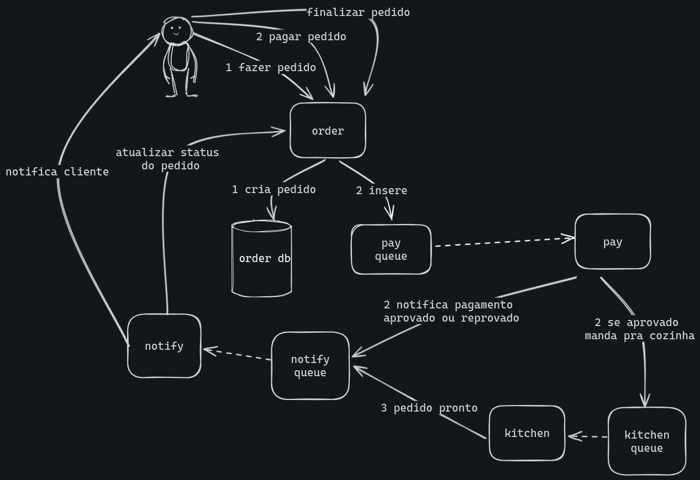
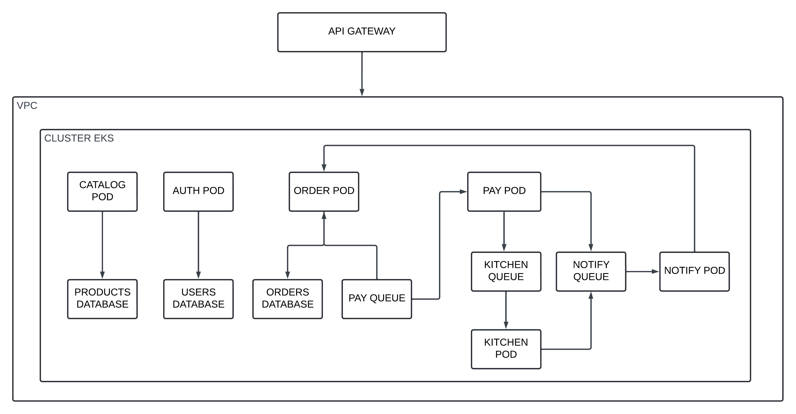

# Tech Challenge Gustavo

Este repositório tem como objetivo documentar e armazenar todo o trabalho realizado para o Tech Challenge da Pós Tech by FIAP.

- **Autor:** Gustavo Costa
- **Matrícula:** RM351316
- **Grupo:** 79

O trabalho é composto por três tópicos, abordando desafios referentes às três disciplinas:

### 1. SAGA Pattern

#### 1.a Escolha do Padrão

O padrão escolhido para o desenvolvimento da SAGA é o **coreografado**. Nele, todos os serviços sabem quais ações tomar em cada etapa. Juntamente com as transações atômicas, isso garante que o estado da aplicação seja sempre consistente. Apesar de ser mais complexo de desenvolver, este método foi escolhido por ser mais dinâmico e visualizável. Cada serviço precisa apenas se preocupar com seu próprio contexto e, ao cumprir seu objetivo, a SAGA é completada.

#### 1.b Arquitetura do Fluxo de Pagamento

O fluxo de pagamento foi arquitetado da seguinte forma. Veja o diagrama abaixo:

No diagrama, o fluxo é representado pelo número 2. O cliente manifesta a intenção de realizar o pagamento, que é recebido e inserido na fila de pagamento. O microsserviço `pay` faz a integração com o gateway e insere na fila `notify`, que é consumida pelo microsserviço `notify`. Este, por sua vez, comunica ao cliente e ao serviço `order` para atualizar o status do pedido. Caso o pagamento seja aprovado, o microsserviço `pay` também insere uma mensagem na fila `kitchen`, que, ao terminar o preparo do pedido, envia uma notificação adicional informando que o pedido está pronto.

Dessa forma, temos um cenário em que, se o pagamento for aprovado, o cliente e a cozinha são notificados. Em caso de reprovação, a cozinha não recebe nenhuma notificação e o cliente é informado do problema.

#### 1.c Serviço de Mensageria

O serviço de mensageria utilizado para a solução foi o RabbitMQ, devido à sua simplicidade e eficiência.

### 2. Desenvolvimento Seguro

Neste tópico, foi solicitado o uso da ferramenta OwaspZap para realizar a varredura dos fluxos de cardápio, criação de pedido e pagamento.

**Observação:** Como não foi desenvolvido um webhook, esse fluxo não foi coberto.

O resultado da primeira varredura está descrito no arquivo [primeiro_relatorio.pdf](./docs/primeiro_relatorio.pdf).

Como não foram encontrados alertas críticos, foram feitas correções nos alertas de severidade média e outros possíveis. Os dois alertas restantes referem-se a requisições HTTPS e configuração de domínio, que não foram implementados neste projeto.

O resultado da segunda varredura, após as correções, está descrito no arquivo [segundo_relatorio.pdf](./docs/segundo_relatorio.pdf).

### 3. LGPD

#### 3.a Relatório RIPD

O Relatório de Impacto à Proteção de Dados (RIPD) está disponível [aqui](./docs/RIPD.pdf).

#### 3.b Funcionalidades Implementadas

Para este tópico, foram criadas duas rotas:
- **`/exclude-data`**: Permite ao usuário solicitar a exclusão dos seus dados.
- **`/approve-exclude-data`**: Permite a um administrador aprovar ou rejeitar a solicitação de exclusão, incluindo a opção de preencher o motivo da não exclusão, conforme exigido pela lei.

### Instruções para Rodar a Aplicação

- Utilize o arquivo disponível em `/infra/compose`. **Observação:** É necessário configurar as variáveis de ambiente para o funcionamento correto.

### Link do Vídeo Explicativo

- [Vídeo explicativo das entregas](https://vimeo.com/992521190)

### Arquitetura em Nuvem

### Explicação dos Diretórios do Projeto

- **`.github`**: Contém a ação que faz a atualização das imagens no Docker Hub.
- **`/docs`**: Armazena todos os documentos e artefatos do Tech Challenge.
- **`/infra`**: Contém os arquivos de configuração de infraestrutura.
  - **`/infra/compose`**: Manifesto Docker Compose para ambiente de desenvolvimento.
  - **`/infra/kubernetes`**: Manifestos para o deploy de toda a arquitetura, incluindo banco, mensageria e microsserviços.
  - **`/infra/sql`**: Scripts SQL para a criação das tabelas necessárias.
  - **`/infra/terraform`**: Infraestrutura como código para criar o cluster EKS e o API Gateway, juntamente com as configurações das rotas.
- **`/services`**: Código fonte de todos os microsserviços, cada um com seu respectivo Dockerfile.
